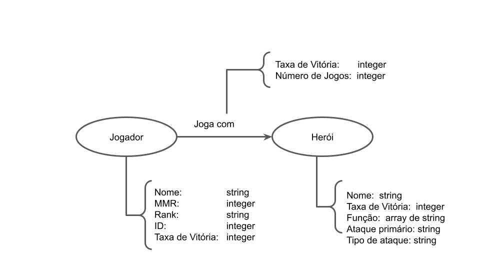

# Apresentação do Lab07 - Modelo Lógico para Banco de Dados de Grafos

# Aluno
* 215743: Felipe Pacheco Manoel

## Modelo Lógico do Banco de Dados de Grafos>
> 

## Perguntas de Pesquisa/análise

> Quais heróis são os que determinado jogador tem maior taxa de vitória ou maior quantidade de partidas jogadas?
> Quais jogadores são melhores ou jogam mais com determinado herói?
> Quais heróis um determinado jogador joga que seguem certos parâmetros como uma determinada função ou determinado tipo de ataque?

