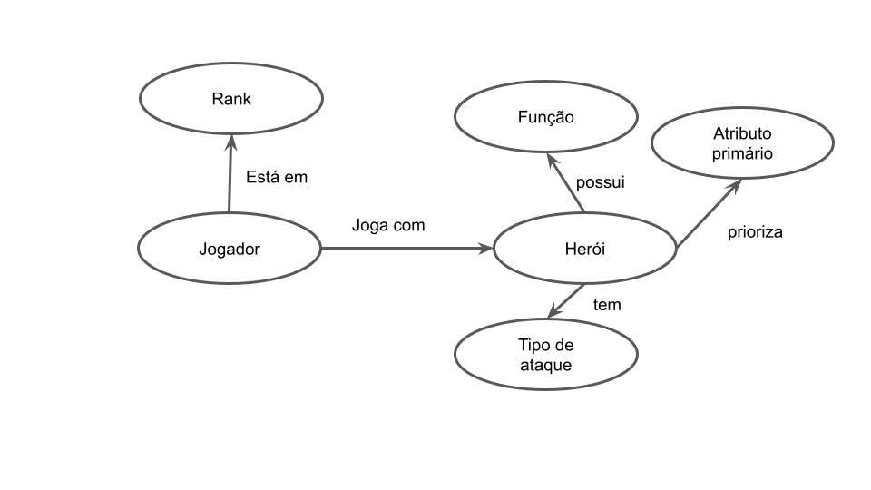

# Apresentação do Lab09 - Grafo de Conhecimento

# Aluno
* `215743`: `Felipe Pacheco Manoel`

## Exemplo de Grafo de Conhecimento - para publicar ou enriquecer
> 
>

## Perguntas de Pesquisa ou Queries

> * Com quais heróis de uma determinado função/atributo primário/tipo de ataque são jogados por um certo jogador?
> * Quais heróis possuem um certo tipo de ataque, atributo primário e certa função?
> * Quais jogadores de um determinado rank jogam com heróis de uma determinada função?
